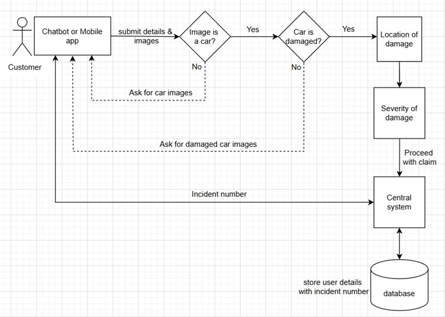

## Car Damage Detection Using Deep Learning to Simplify Car Insurance Claim process

## GOAL OF THE PROJECT  
Filing a car insurance claim after an accident can be a frustrating and time-consuming process. Imagine you have just been in an accident and need to contact your insurance company. To initiate the claim, you are required to submit various documents, including insurance paperwork, photos of the accident scene and vehicle damage and potentially even dash cam footage. This initial data collection is just the beginning of a potentially lengthy process.

The insurance agent handling your claim must then meticulously gather and store all this information, leaving room for potential human error. The entire process of assessing the damage, determining fault, and agreeing on repair costs can involve numerous back-and-forth exchanges between you and your insurer. 
This back-and-forth, coupled with the tedious nature of gathering and processing information, can lead to frustration for both the claimant and the insurance provider.
To streamline and improve the car insurance claims process, Machine Learning, specifically Deep Learning and Computer Vision, can be leveraged to automate damage assessments and detect fraudulent claims.

In addition, this model can be extended for use in building insurance by adapting it to detect and classify structural damage in property images, enabling automated claim processing, damage severity assessment, and fraud detection in residential and commercial insurance workflows

## PROCESS
Users can submit car images via a chatbot or mobile app. The model then processes these images in four stages: 
1) Car image verification 
2) Damage confirmation 
3) Damage location identification (front, rear, side) and 
4) Damage severity assessment (minor, moderate, severe) as per below flow:
   

The notebooks included in the repo covers only first part of the flow as clasifying uploaded image by user is a car or not to proceed for next checks.

## DATA  
The dataset used is the [Car Damage Detection dataset](https://www.kaggle.com/datasets/anujms/car-damage-detection/data) by Anuj M S, hosted on Kaggle. It contains hundreds of whole and damaged images of cars, organized into folders that represent different types. 
The dataset is publicly available and does not include sensitive or personal information.

## MODEL  
The model used is VGG16, a deep convolutional neural network known for its simplicity and strong performance in image classification tasks. VGG16 was fine-tuned on the car damage dataset to adapt its learned features to the specific task. Grad-CAM was integrated to visualize which parts of the image the model focuses on when predicting damage.

### **IMPORTANT**

Keras notebook is [here](imageiscarornot_using_tfkeras.ipynb) and easily viewable.

Pytorch notebook size is little bigger and cannot viewed on GitHub, I tried to [zip](imageiscarornot_using_pytorchgradcam.zip) it and upload but not successful. 

Please download either zip folder or [notebook](imageiscarornot_using_pytorchgradcam.ipynb) at local and view it [here](https://mybinder.org/v2/gh/gitpatil2025/capstone-IMPAIML-2501/1783ac43ddc29d71fc3445ae376da4b833d83d27?urlpath=lab%2Ftree%2Fimageiscarornot_using_pytorchgradcam.ipynb) online, sorry for the inconvenience caused.

## HYPERPARAMETER OPTIMISATION  
Since the model is not retrained, traditional hyperparameter tuning (e.g., learning rate, batch size) is mostly not applicable at this stage. 
However, I tried to optimize the category filtering strategy by dynamically extracting car-related labels from ImageNet using semantic similarity via WordNet. 
I have experimented with different top-N prediction depths (e.g., top-3 vs. top-5) to balance precision and recall.

## RESULTS  
I have used here two different approches to classify the car images - using Keras and Pytorch with GradCam as it was difficult to combine them together.
The optimized model achieved an accuracy of **84%+** on the validation set in both the approches 
Grad-CAM visualizations confirmed that the model focused on relevant vehicle regions in correctly classified images. These results suggest that the model can reliably classify car damage types and could be extended to real-world applications with further validation.

## CHALLENGES
o	Non-clear images of car damage, along with variations in angle, lighting and resolution can significantly affect accurate image classification and damage assessment

o	Since the data is image-based, not numeric, a robust and diverse dataset of images with clearly defined categories is crucial for effective model training as I have used very small dataset here

o	While automation reduces human error, the model should be designed to flag specific situations requiring human review and intervention in case of any specific missing data

### NEXT ACTIONS
o	Class balancing: Considering oversampling non-car images or using SMOTE to improve generalization.

o	Error analysis: Reviewing the misclassified samples using Keras/Grad-CAM to understand model focus.

o	Threshold tuning: Experiment with adjusting the decision threshold to reduce false positives.

o	Model calibration: Use of techniques like Platt scaling or isotonic regression to improve confidence estimates.

## CONTACT DETAILS

Feel free to reach out via [GitHub](https://github.com/gitpatil2025) or email me at gitanjalipatil2025@gmail.com for collaboration or feedback.

